# 机场推荐

长期免费订阅: [一键导入](https://subsub.surge.sh/?url=https%3A%2F%2Fraw.githubusercontent.com%2Fgo4sharing%2Fsub%2Fmain%2Fsub.yaml)

更多机场请到 https://t.me/s/go4sharing

欢迎投稿 ~ ~ ~

欢迎留言 ~ ~ ~

## 免费机场
免费可能有时效性, 手慢无

> 免费的还要什么自行车啊, 冲TMD!!!

### 飞一般
50G/月, 5个节点

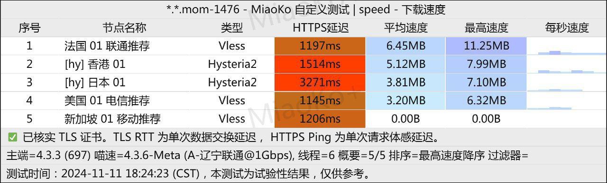

白嫖码: `白嫖`

注册地址: https://i.fei.best/#/login?code=7FdSiRQY

### 动力港
200G/月, 70个节点

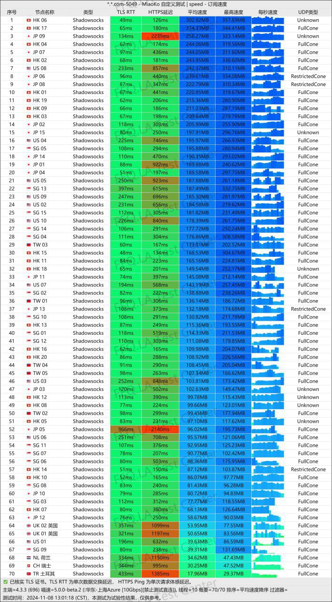

> 进群获取白嫖码

官方群: https://t.me/dlg365

注册地址: https://site01.dongligang.me/#/register?code=RuDAQYp7

### 九毛九机场✈️
500G/月, 15个节点

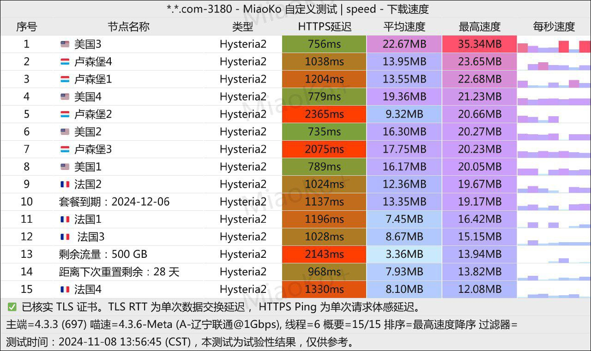

> 进群获取白嫖码

官方群: https://t.me/jiumaojiu_chat

注册地址: https://app.lwjyj.com/#/register?code=AlcUuZIH

### 三瓜云
50G/月, 12个节点

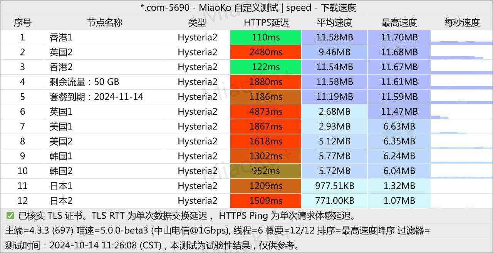

进群发送 `我爱三瓜云` 获取白嫖码

官方群: https://t.me/sanguayun

注册地址: https://snangua.com/#/register?code=zydft5pw

### 狮云
1T/月, 13个节点

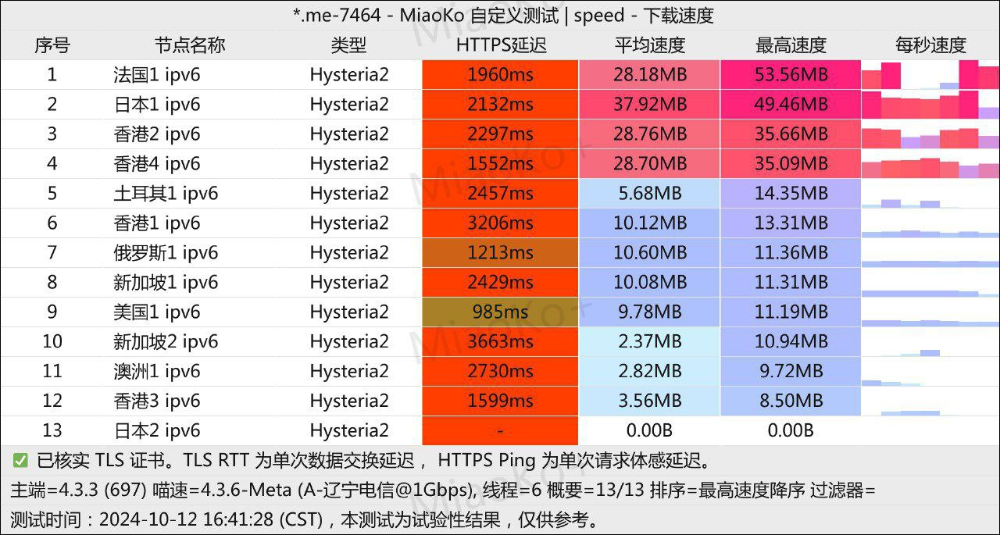

> 进群获取白嫖码

官方群: https://t.me/cloudlion_chat

注册地址: https://app.cloudlion.me/#/register?code=ybiLMSYW

### Kei Network
100G/月, 9个节点

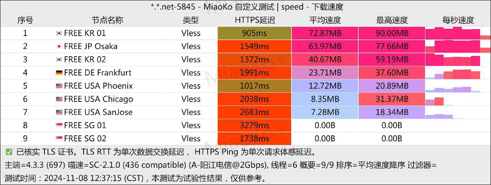

官方群: https://t.me/keimix

注册地址: https://my.kei.one/#/register?code=GYcXldon

### 富强机场
50G/月, 16个节点

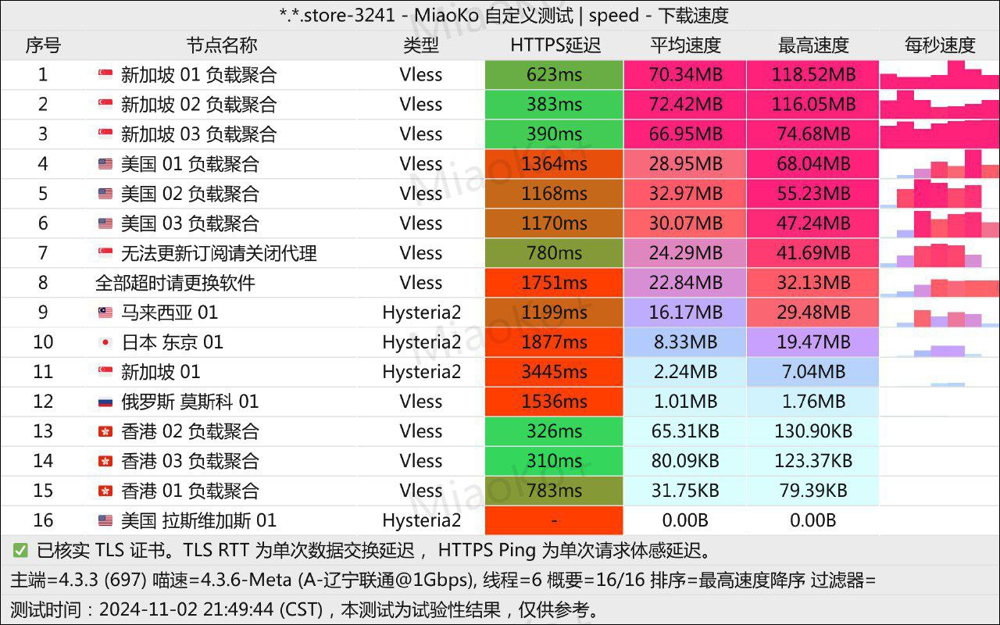

白嫖码: `fq`
官方群: https://t.me/fqjc_group

注册地址: https://fqjc.xyz/#/register?code=NeC06yzp

### 白嫖机场
50G/月, 15个节点

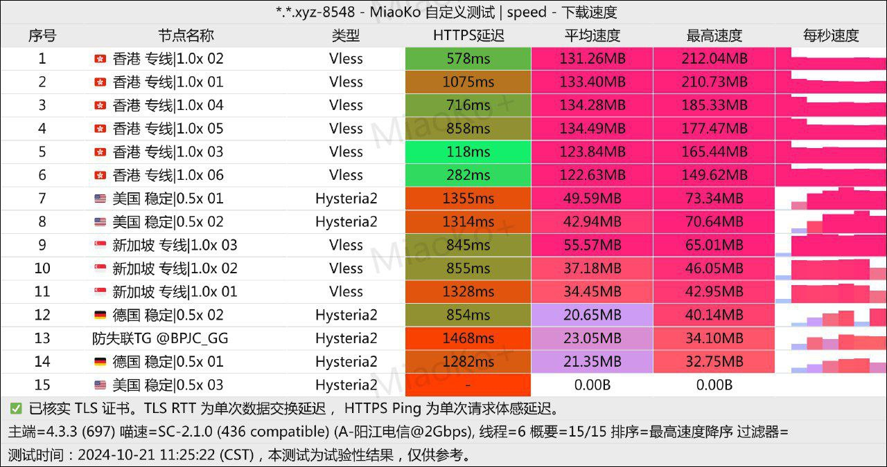

白嫖码: `白嫖机场`
官方群: https://t.me/BPJC_ORG

注册地址: https://xn--mesv7f5toqlp.org/#/login?code=qsulnfEC

## 性价比机场

### acyun
2元300G/月, 50+节点, 冷门地区

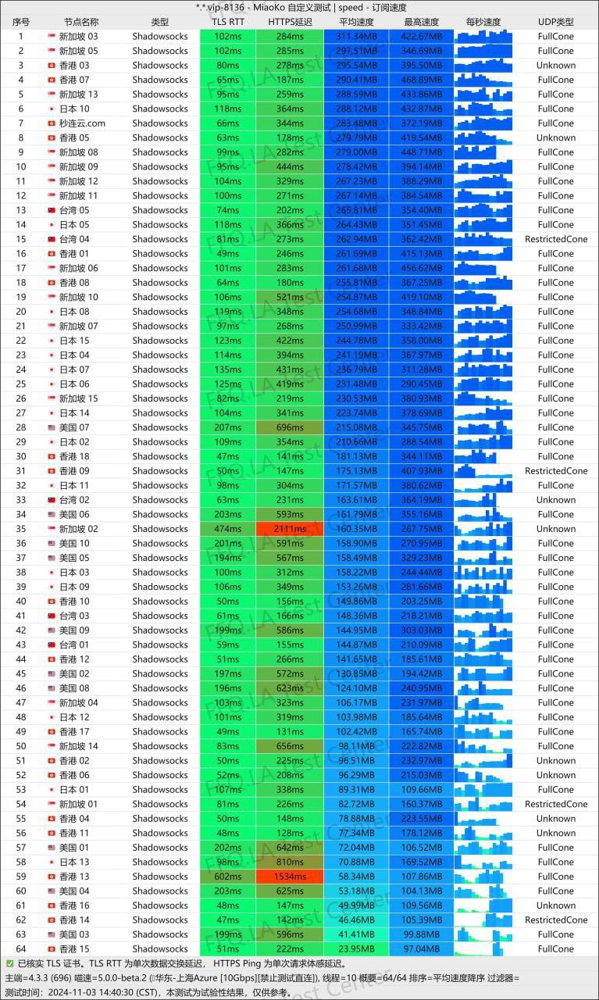

官方群: https://t.me/acyun1

注册地址: https://swacyun.yydsii.com/index.php#/register?code=gtec3f2H

### 🎃小南瓜
5.99元/年, 每月150G, 15个节点

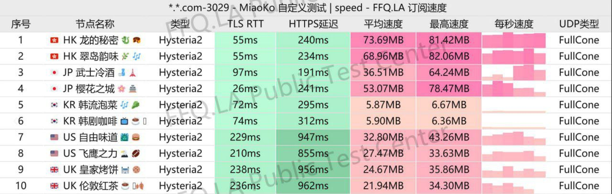

官方群: https://t.me/xiaonanguacloud

注册地址: https://minizz.online/#/register?code=oblMIhzq

## 优质机场

### 秒连云
220G/月, 66个节点, 5个地区

官方群: https://t.me/miaolianyun

注册地址: https://mly01.miaolianyun.my/#/register?code=soSx277r

### 极速云
9.9元100G/月, 80+节点

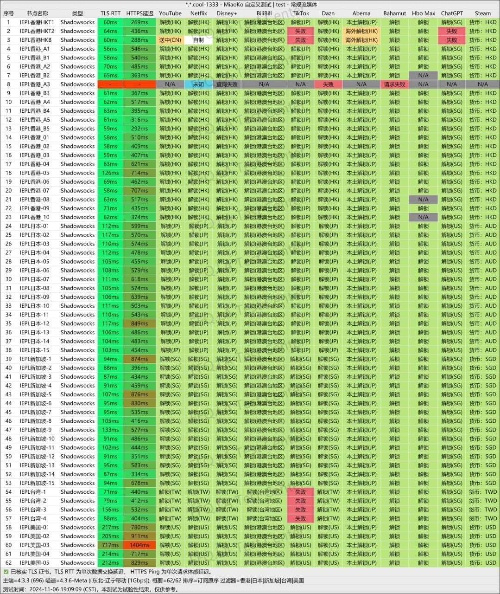

官方群: https://t.me/jisuyunchat

注册地址: https://w1.lypyf.com/#/register?code=AWqhYEii

本文总阅读量  次
本站总访问量  次
本站总访客数  人

## 来都来了, 留下点什么?

<link rel="stylesheet" href="https://cdn.jsdelivr.net/npm/gitalk@1/dist/gitalk.css">

